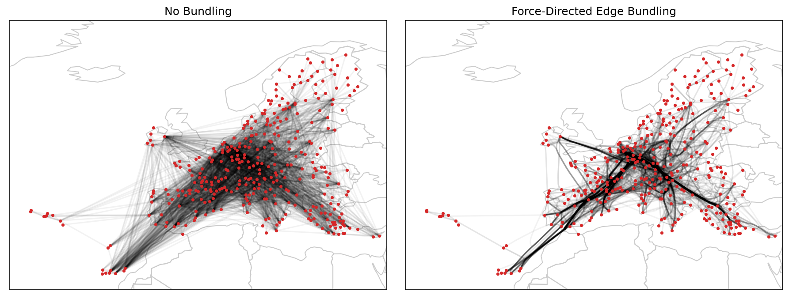

# Force-Directed Edge Bundling (FDEB)

[](https://opensource.org/licenses/BSD-3-Clause)



## Installation

`fdeb` can be easily installed through pip using

```
pip install fdeb
```

## Usage

```python
edges = ...  # (N, 2, 2) -> N edges, each with two endpoints in 2D

from fdeb import fdeb
optimized_edges = fdeb(edges)
```

## Notes

This package currently implements a numpy-only version of the FDEB algorithm, which has asymptotic complexity O(n^2), making it too slow and memory-hungry for large numbers of graphs.

A numba version of this algorithm is also available at https://github.com/verasativa/python.ForceBundle, however, it also implements the O(n^2) algorithm, so it should (asymptotically) run equally slowly as this package, but is more memory efficient, and perhaps a bit faster on larger graphs.

## A longer example

```python
import numpy as np
import networkx as nx

from fdeb import fdeb

import matplotlib.pyplot as plt
import matplotlib.collections as collections


# Setup embedding and graph
g = nx.karate_club_graph()
x = np.array(list(nx.spring_layout(g).values()))
adj = nx.to_scipy_sparse_array(g).tocoo()

# Extract edges from embedding and adjacency matrix
edges = np.stack([x[adj.row], x[adj.col]], axis=1)

# Compute FDEB
edges_fdeb = fdeb(edges)

# Plot results
fig, ax = plt.subplots(ncols=2, figsize=(8, 4), dpi=150)

collection = collections.LineCollection(edges, color="k", alpha=0.05)
ax[0].add_collection(collection)
ax[0].scatter(x[:, 0], x[:, 1], c="tab:red", s=3, zorder=3)

collection = collections.LineCollection(edges_fdeb, color="k", alpha=0.05)
ax[1].add_collection(collection)
ax[1].scatter(x[:, 0], x[:, 1], c="tab:red", s=3, zorder=3)
```
